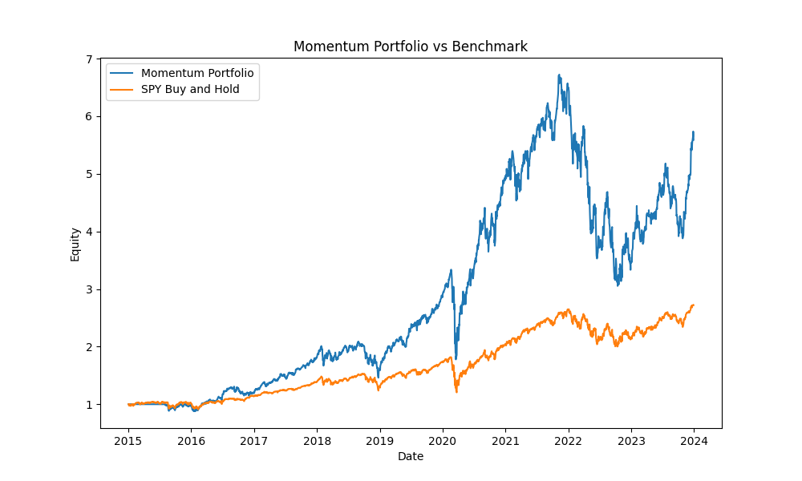
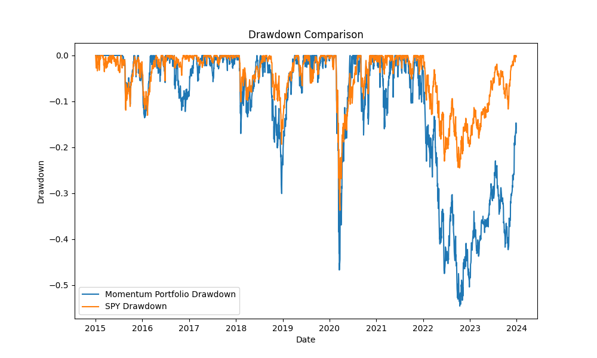

# Multi-Asset Momentum Backtest

A Python backtesting project for a multi-asset momentum portfolio strategy.

## Project Overview

This project builds a multi-asset momentum portfolio backtesting system.

The strategy selects the strongest assets based on past momentum and rebalances the portfolio monthly.

## Asset Universe

The strategy uses the following ETFs:

- SPY: S&P 500 ETF
- QQQ: Nasdaq 100 ETF
- IWM: Russell 2000 ETF
- TLT: Long-Term Treasury ETF
- GLD: Gold ETF

## Strategy Logic

The strategy follows these steps:

1. Download historical ETF price data
2. Calculate 126-day momentum for each asset
3. Rank assets by momentum
4. Select the top 2 assets
5. Allocate equal weight to selected assets
6. Rebalance monthly
7. Apply transaction costs
8. Compare performance against SPY buy-and-hold

## Tools Used

- Python
- pandas
- numpy
- matplotlib
- yfinance

## How to Run

Install dependencies:

```bash
pip install -r requirements.txt
```

Run the backtest:

```bash
python src/backtest.py
```

## Performance Summary

| Metric | Momentum Portfolio | SPY Benchmark |
|---|---:|---:|
| Total Return | 458.95% | 171.91% |
| CAGR | 21.10% | 11.77% |
| Volatility | 30.06% | 18.09% |
| Sharpe Ratio | 0.79 | 0.71 |
| Max Drawdown | -54.59% | -33.72% |
| Calmar Ratio | 0.39 | 0.35 |

The momentum portfolio achieved a higher total return and CAGR than the SPY benchmark. However, it also had higher volatility and a deeper maximum drawdown, meaning the strategy took more risk to generate higher returns.

## Results

### Equity Curve



### Drawdown



## Output Files

The project generates:

- `results/equity_curve.png`
- `results/drawdown.png`
- `results/weights.csv`
- `results/backtest_results.csv`
- `results/performance_report.csv`

## Performance Metrics

The project calculates:

- Total Return
- CAGR
- Volatility
- Sharpe Ratio
- Maximum Drawdown
- Calmar Ratio

## Disclaimer

This project is for educational purposes only. It is not financial advice.
